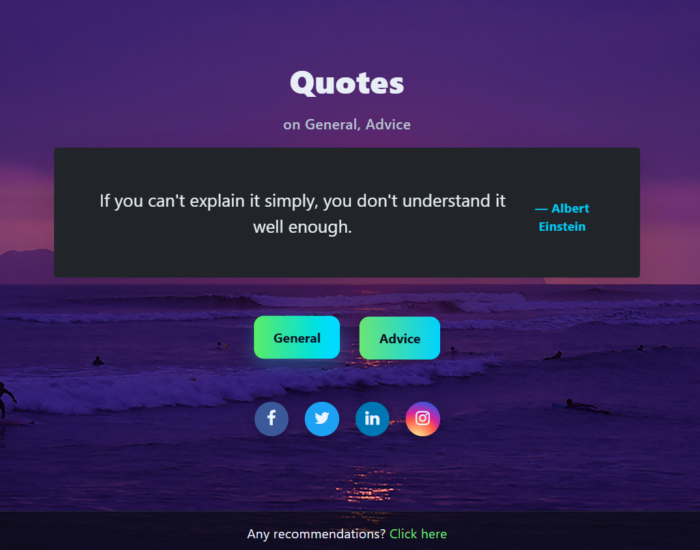

# Quotes Generator (General + Advice)

A simple, modern web app that fetches random quotes and advice from public APIs. Built with vanilla HTML/CSS/JS and styled with a clean, responsive UI.



## Features
- **Two sources**: General quotes and life advice
- **Clean UI**: Glassy dark theme, responsive typography, subtle animations
- **Author line**: Quote author is displayed on a separate line for clarity
- **Share ready**: Social icons included (Facebook, Twitter/X, LinkedIn, Instagram)
- **No build step**: Runs locally by just opening `index.html`

## Tech Stack
- **HTML5** for structure
- **CSS3** with a custom design and Bootstrap utilities
- **JavaScript (fetch API)** for calling external APIs
- **Font Awesome** for social icons

## Live Demo
If you deploy this (see Deployment), you can add your hosted link here.

## Getting Started

### Prerequisites
- A modern browser (Chrome, Edge, Firefox, Safari)
- Optional: a local static server for CORS-friendly development

### Run locally
1. Clone the repository:
```bash
git clone <your-fork-or-repo-url>.git
cd quotes-main
```
2. Open the app:
   - Easiest: double-click `quotes-main/index.html` to open in your browser, or
   - Use a local server (recommended for consistent behavior):
```bash
# using npm http-server
npm install -g http-server
http-server quotes-main -o

# or using Python 3
python -m http.server --directory quotes-main 5173
# then open http://localhost:5173 in your browser
```

## Usage
- Click the "General" button to fetch a random quote.
- Click the "Advice" button to fetch a random piece of advice.
- The quote text and the author are rendered on separate lines for readability.

## Project Structure
```text
quotes-main/
├─ images/
│  ├─ horizontal.jpg
│  └─ horizontalone.jpg
├─ index.html
├─ quote.css
├─ quote.js
├─ quotepic.png
└─ README.md
```

## APIs Used
- Quotable (random quote): [Quotable API](https://github.com/lukePeavey/quotable)
  - Endpoint used: `https://api.quotable.io/random`
- Advice Slip (random advice): [Advice Slip API](https://api.adviceslip.com/)
  - Endpoint used: `https://api.adviceslip.com/advice`

Both are free and unauthenticated as of writing. Check their docs for rate limits or changes.

## Customization
- **Colors and theme**: Edit CSS variables in `quote.css` under `:root` to adjust background, text, and accent colors.
- **Background images**: Replace `images/horizontal.jpg` and `images/horizontalone.jpg` with your assets; paths are defined via CSS variables.
- **Buttons and spacing**: Adjust `.button` and spacing variables for your brand.
- **Author style**: Tweak `.quote-author` in `quote.css` to change size, color, or alignment.

Example: right-align the author
```css
.quote-author {
    text-align: right;
    opacity: 0.9;
}
```

## Accessibility
- Uses sufficient color contrast for text on dark backgrounds.
- Focus states are enabled via hover/focus styles.
- Loading indicator has an accessible label via Bootstrap's visually hidden text.

## Deployment
Any static hosting works:
- GitHub Pages
- Netlify
- Vercel
- Cloudflare Pages

Typical steps (GitHub Pages example):
1. Push to a public GitHub repo.
2. In repo settings → Pages, set the branch to `main` (or `master`) and folder to `/quotes-main`.
3. Wait for the site to build and use the provided URL.

## Contributing
Contributions are welcome! Feel free to open issues or PRs for fixes, improvements, or new features.

## License
This project is open source under the MIT License. You can replace this section with another license as needed.

## Acknowledgements
- [Quotable API](https://github.com/lukePeavey/quotable)
- [Advice Slip API](https://api.adviceslip.com/)
- [Bootstrap](https://getbootstrap.com/) and [Font Awesome](https://fontawesome.com/)
